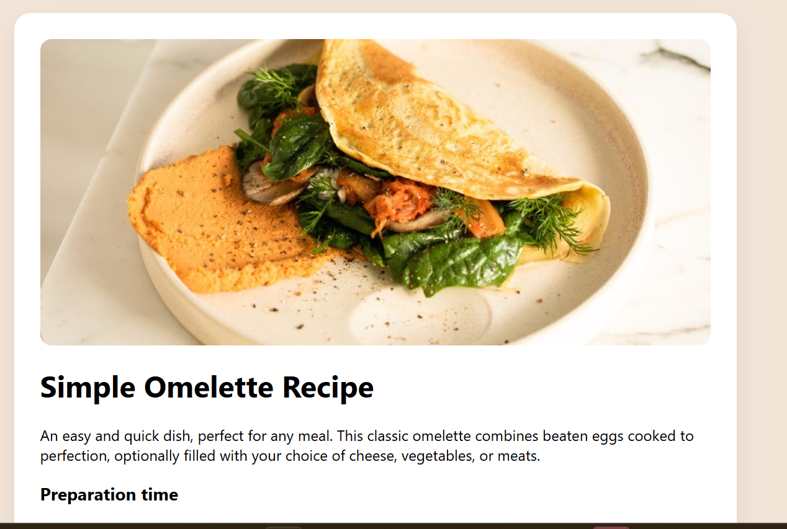

# Recipe page

# Overview

This project involved recreating a responsive recipe layout based on provided design files. The primary goal was to translate a static visual design into a clean, structured HTML and CSS implementation while maintaining layout accuracy, spacing consistency, and responsive behavior.

Links

Solution URL: https://www.frontendmentor.io/solutions/single-page-recipe-app-created-with-html-css-and-vs-code-dfGf-Oj5WY

Live Site URL: https://recipe-page-main-git-main-fortunengilis-projects.vercel.app/

# My process
Built with

Semantic HTML5 markup

CSS custom styling

Flexbox layout

# What I learned

This challenge reinforced several foundational frontend concepts:

* Proper content structuring using semantic HTML
* The importance of container-based layouts
* Centering strategies using Flexbox
* Correct table markup and alignment techniques
* Spacing consistency and visual hierarchy

# Continued development

Going forward, I plan to focus on:

* Improving responsive layout precision
* Refining spacing systems and typography scales
* Building reusable UI components
* Strengthening CSS architecture practices
* Expanding into component-driven frameworks

# Useful resources

Frontend Mentor community solutions

# Author

Frontend Mentor – https://www.frontendmentor.io/profile/Fortunengili
GitHub – https://github.com/Fortunengili/recipe-page-main

# Acknowledgments

Frontend Mentor for providing structured, design-driven challenges that simulate practical frontend development scenarios.
